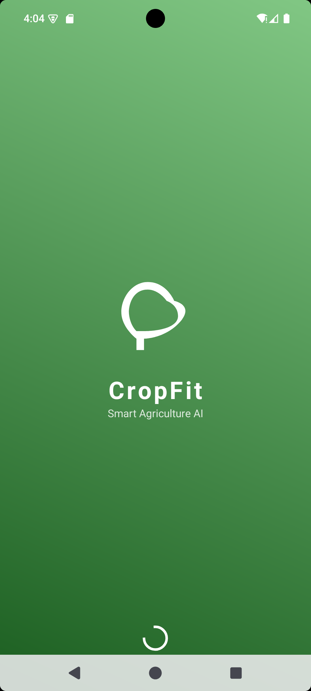
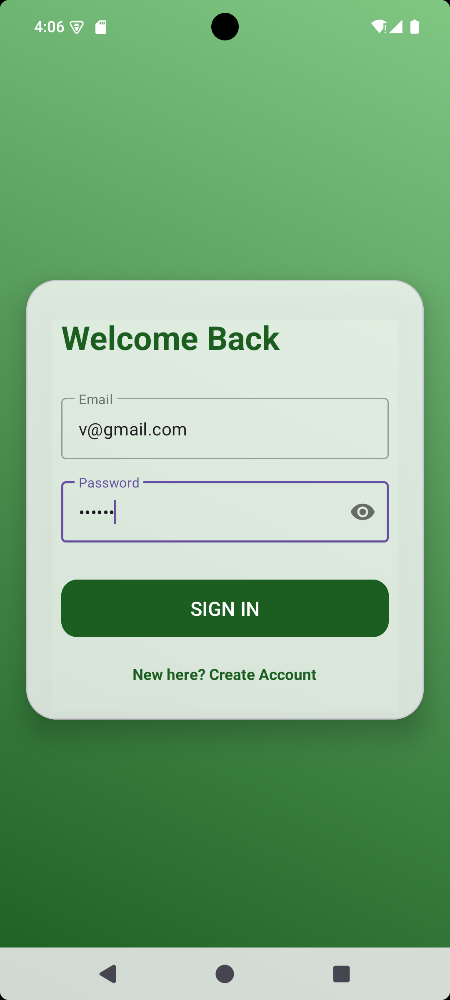
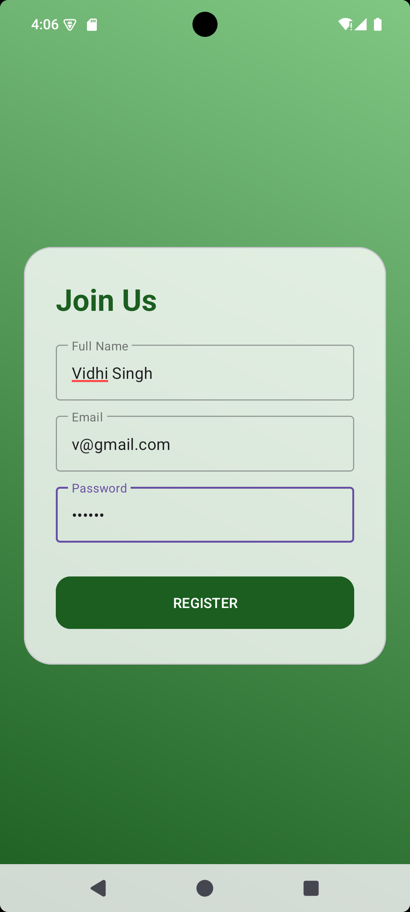
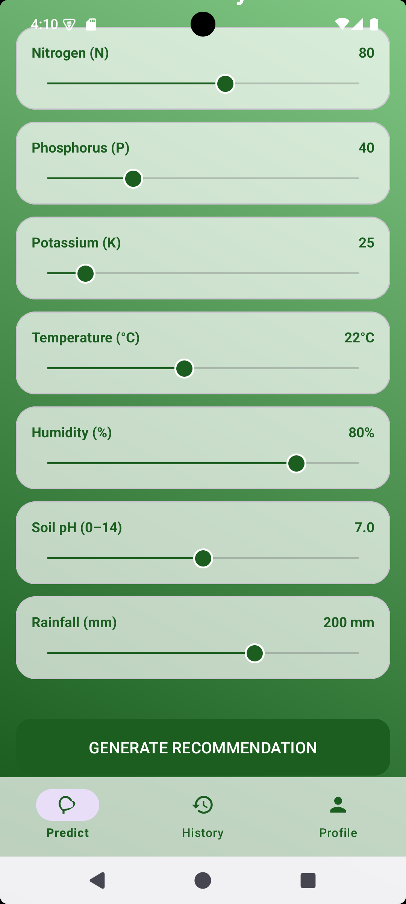
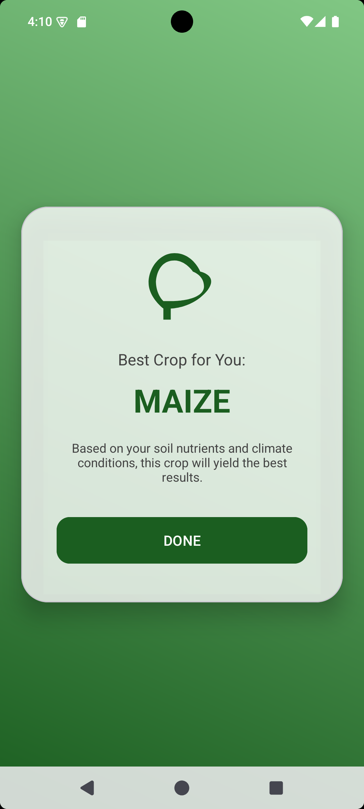
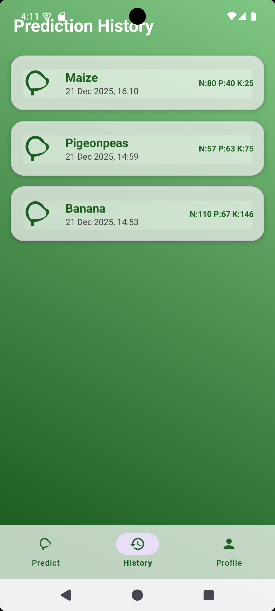
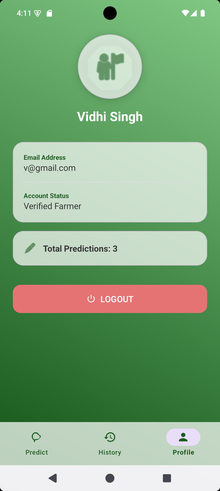

<h1 align="center">🌿 CropFit | Smart Agriculture App 🌾</h1>

<h2 align="center">📌 Overview</h2>

CropFit is an Android application that helps users choose the right crop based on soil and weather conditions.
The user provides values such as Nitrogen (N), Phosphorus (P), Potassium (K), temperature, humidity, pH, and rainfall.
Based on these inputs, the app predicts the most suitable crop using a machine learning model.
The application also stores previous predictions and maintains user profile details.

<h2 align="center">🔧 Tech Stack</h2>

<table border="1" cellpadding="6" cellspacing="0" align="center">
  <tr>
    <th>Technology</th>
    <th>Usage</th>
  </tr>
  <tr>
    <td>Java</td>
    <td>Used for application logic and fragment handling</td>
  </tr>
  <tr>
    <td>Firebase Authentication</td>
    <td>User login and sign-up using email and password</td>
  </tr>
  <tr>
    <td>Firebase Firestore</td>
    <td>Stores user information and prediction history</td>
  </tr>
  <tr>
    <td>AI / ML Model</td>
    <td>Crop prediction logic implemented in CropModel.java</td>
  </tr>
  <tr>
    <td>View Binding</td>
    <td>Connects UI elements safely with Java code</td>
  </tr>
  <tr>
    <td>XML Layouts</td>
    <td>Used to design app screens with a clean interface</td>
  </tr>
</table>

<h2 align="center">📜 App Flow & Architecture</h2>

<b>1. Splash & Authentication:</b> 
The app opens with a splash screen followed by login or sign-up using Firebase Authentication.

<b>2. Home Screen:</b> 
Users enter soil and weather values using sliders and input fields.

<b>3. Prediction:</b> 
The entered values are passed to the machine learning model to predict the best crop.

<b>4. Result Screen:</b> 
The predicted crop is displayed clearly to the user.

<b>5. History & Profile:</b> 
All predictions are saved in Firestore and shown in the history section.
The profile screen displays user details and total predictions.

<h2 align="center">🚀 App Preview</h2>

<table align="center" cellpadding="10">
  <tr>
    <td align="center">
       
      <small>Splash Screen</small>
    </td>
    <td align="center">
       
      <small>Login Screen</small>
    </td>
    <td align="center">
       
      <small>Sign Up Screen</small>
    </td>
  </tr>

  <tr>
    <td align="center">
       
      <small>Home Screen</small>
    </td>
    <td align="center">
       
      <small>Result Screen</small>
    </td>
    <td align="center">
       
      <small>History Screen</small>
    </td>
  </tr>

  <tr>
    <td align="center">
       
      <small>Profile Screen</small>
    </td>
  </tr>
</table>

<h2 align="center">⚡ Installation & GitHub Upload Guide</h2>

<h3>Upload Project to GitHub</h3>

<pre>
git init
git add .
git commit -m "Initial commit - CropFit App"
git remote add origin https://github.com/svidhi08/CropFit.git
git push -u origin main
</pre>

<h3>Run Project Locally</h3>

<ol>
  <li>Clone the repository from GitHub</li>
  <li>Add <code>google-services.json</code> inside the <code>app/</code> folder</li>
  <li>Enable Email/Password Authentication and Firestore in Firebase Console</li>
  <li>Open the project in Android Studio and click Run</li>
</ol>

<h2 align="center">⚡ Future Enhancements</h2>

<table border="1" cellpadding="8" cellspacing="0" align="center">
  <tr>
    <th>Feature</th>
    <th>Description</th>
    <th>Status</th>
  </tr>
  <tr>
    <td>Live Weather API</td>
    <td>Automatically fetch weather data using location</td>
    <td>Planned</td>
  </tr>
  <tr>
    <td>Crop Disease Detection</td>
    <td>Detect plant diseases using camera and AI</td>
    <td>Planned</td>
  </tr>
  <tr>
    <td>Multi-language Support</td>
    <td>Support for regional languages</td>
    <td>In Progress</td>
  </tr>
  <tr>
    <td>Delete History</td>
    <td>Allow users to remove old predictions</td>
    <td>Completed</td>
  </tr>
</table>

 

Developed by <a href="https://github.com/svidhi08">svidhi08</a>

